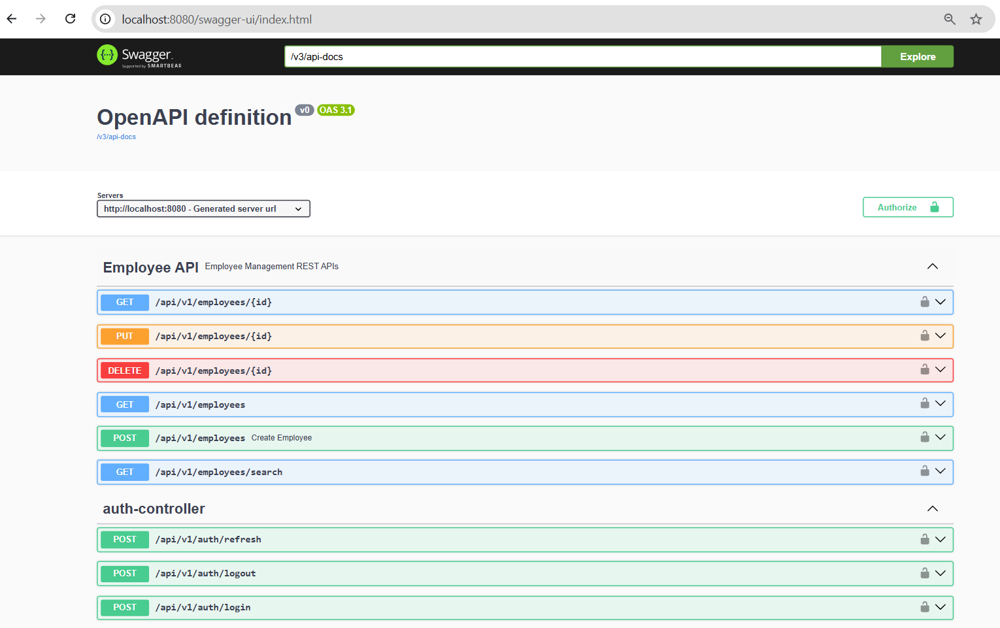
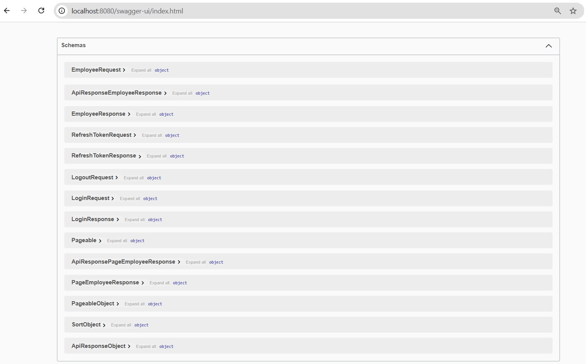
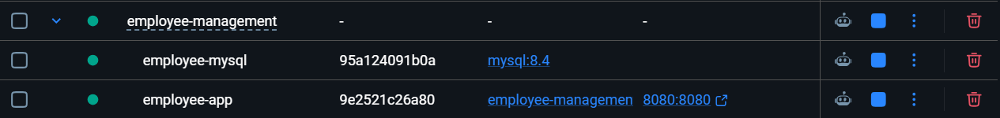

# 👨‍💻 Employee Management System

A production-ready Employee Management REST API built using **Java 21** and **Spring Boot 3.5**.

This project demonstrates enterprise backend development practices including REST API development, JWT authentication, role-based authorization, validation, exception handling, pagination, dynamic search, automated testing, Docker containerization, and GitHub Actions CI.


---

## Features

- Employee CRUD Operations
- JWT Authentication
- Refresh Token
- Role-Based Authorization
- ADMIN / USER Roles
- Spring Security
- BCrypt Password Encryption
- Request Validation
- Global Exception Handling
- Pagination
- Sorting
- Dynamic Employee Search using JPA Specifications
- Swagger / OpenAPI Documentation
- Unit Testing with JUnit 5 and Mockito
- Integration Testing with H2
- Docker
- Docker Compose
- GitHub Actions CI

---

## Tech Stack

| Technology | Purpose |
|---|---|
| Java 21 | Programming Language |
| Spring Boot 3.5.4 | Backend Framework |
| Spring Security | Authentication & Authorization |
| JWT | Token-based Authentication |
| Spring Data JPA | Data Access |
| Hibernate | ORM |
| MySQL 8 | Production Database |
| H2 | Testing Database |
| Maven | Build & Dependency Management |
| Swagger / OpenAPI | API Documentation |
| JUnit 5 | Testing |
| Mockito | Mocking |
| Docker | Containerization |
| Docker Compose | Multi-container Application |
| GitHub Actions | CI Pipeline |

---

## Architecture

The application follows a layered architecture:

```text
Client
  │
  │ HTTP / HTTPS
  ▼
Controller Layer
  │
  ▼
Service Layer
  │
  ▼
Repository Layer
  │
  ▼
MySQL Database
```


### Main Layers

**Controller Layer**
- Handles HTTP requests and responses.
- Performs request validation.
- Exposes REST APIs.

**Service Layer**
- Contains business logic.
- Handles employee operations.
- Coordinates authentication and token operations.

**Repository Layer**
- Uses Spring Data JPA.
- Communicates with the database.

**Security Layer**
- JWT authentication.
- JWT authorization.
- Role-based access control.
- BCrypt password encryption.

**Exception Handling**
- Centralized exception handling using `@RestControllerAdvice`.

---

## Security

The application implements JWT-based authentication and authorization.

### Authentication Flow

```text
User
 │
 │ Login
 ▼
Auth Controller
 │
 ▼
Authentication Manager
 │
 ▼
User Details Service
 │
 ▼
JWT Service
 │
 ▼
Access Token + Refresh Token
```

### Security Features

- JWT Access Token
- Refresh Token
- BCrypt Password Encryption
- Role-Based Authorization
- ADMIN / USER roles
- Authentication Entry Point
- Access Denied Handler
- Protected Employee APIs

---

# API Endpoints

## Authentication APIs

| Method | Endpoint | Description | Authentication |
|---|---|---|---|
| POST | `/api/auth/register` | Register a new user | No |
| POST | `/api/auth/login` | Login and receive access token | No |
| POST | `/api/auth/refresh` | Refresh access token | No |

---

## Employee APIs

| Method | Endpoint | Description | Role |
|---|---|---|---|
| GET | `/api/employees` | Get all employees with pagination | ADMIN / USER |
| GET | `/api/employees/{id}` | Get employee by ID | ADMIN / USER |
| POST | `/api/employees` | Create employee | ADMIN |
| PUT | `/api/employees/{id}` | Update employee | ADMIN |
| DELETE | `/api/employees/{id}` | Delete employee | ADMIN |
| GET | `/api/employees/search` | Search employees using filters | ADMIN / USER |

---

## API Documentation

The application uses **Swagger / OpenAPI** for interactive API documentation.

After starting the application, open:

**Swagger UI**

`http://localhost:8080/swagger-ui/index.html`

### Swagger UI



### Swagger API Response



---

# Docker

The application can be run using Docker and Docker Compose.

## Docker Architecture

```text
                    Docker Compose
                         │
             ┌───────────┴───────────┐
             │                       │
             ▼                       ▼
      Employee App              MySQL 8.4
      Port: 8080                Port: 3307
             │                       │
             └───────────┬───────────┘
                         │
                    Docker Network
```

### Docker Containers



---

## Build Docker Image

```bash
docker build -t employee-management .
```

---

## Run with Docker Compose

```bash
docker compose up
```

To run in detached mode:

```bash
docker compose up -d
```

---

## Stop Containers

```bash
docker compose down
```

---

## View Running Containers

```bash
docker compose ps
```

---

## Application URLs

| Service | URL |
|---|---|
| Application | `http://localhost:8080` |
| Swagger UI | `http://localhost:8080/swagger-ui/index.html` |
| MySQL | `localhost:3307` |

Inside Docker Compose, the application connects to MySQL using:

```text
jdbc:mysql://mysql:3306/employee_db
```

The host machine uses port `3307` to avoid conflicts with an existing MySQL installation.

---

# 💻 Running Locally

## 1. Clone the repository

```bash
git clone https://github.com/SrilekhaShankar22/employee-management.git
cd employee-management
```

## 2. Configure Environment Variables

The application uses environment variables for sensitive configuration.

Example:

```text
JWT_SECRET=<your-secret>
JWT_EXPIRATION=86400000

SPRING_DATASOURCE_URL=jdbc:mysql://localhost:3306/employee_db
SPRING_DATASOURCE_USERNAME=<your-username>
SPRING_DATASOURCE_PASSWORD=<your-password>
```

Do not commit real credentials or secrets to GitHub.

---

## 3. Build the Application

```bash
mvn clean install
```

---

## 4. Run the Application

```bash
mvn spring-boot:run
```

The application will be available at:

```text
http://localhost:8080
```

---

# Testing

The project contains both unit tests and integration tests.

### Run all tests

```bash
mvn test
```

### Generate JaCoCo Coverage Report

```bash
mvn clean test jacoco:report
```

The report will be generated under:

```text
target/site/jacoco/index.html
```

### Testing Stack

- JUnit 5
- Mockito
- Spring Boot Test
- MockMvc
- H2 Database

---

# CI – GitHub Actions

The project uses GitHub Actions for Continuous Integration.

The workflow automatically runs when code is pushed to `main` or `master`, or when a pull request is created.

### CI Pipeline

```text
Git Push / Pull Request
          │
          ▼
    Checkout Source
          │
          ▼
      Setup Java 21
          │
          ▼
     Maven Compile
          │
          ▼
       Run Tests
          │
          ▼
    Package Application
          │
          ▼
        SUCCESS
```

### Pipeline Steps

- Checkout source code
- Setup Java 21
- Maven compile
- Run unit and integration tests
- Package the application


---

# Project Structure

```text
employee-management
│
├── .github
│   └── workflows
│       └── ci.yml
│
├── src
│   ├── main
│   │   ├── java
│   │   │   └── com.emsee.employeemanagement
│   │   │       ├── config
│   │   │       ├── controller
│   │   │       ├── dto
│   │   │       ├── entity
│   │   │       ├── enums
│   │   │       ├── exceptions
│   │   │       ├── mapper
│   │   │       ├── repository
│   │   │       ├── security
│   │   │       ├── service
│   │   │       └── specification
│   │   │
│   │   └── resources
│   │       └── application.yaml
│   │
│   └── test
│       ├── java
│       └── resources
│
├── Dockerfile
├── docker-compose.yml
├── pom.xml
└── README.md
```

---

# Future Enhancements

- Redis Cache
- Email Notification
- Flyway Database Migration
- Kubernetes Deployment
- AWS Cloud Deployment
- Continuous Deployment
- Monitoring and Observability

---

# Author

**Srilekha Shankar**

Java / Spring Boot Backend Developer

GitHub: `SrilekhaShankar22`

---

⭐ If you find this project useful, consider giving it a star!
